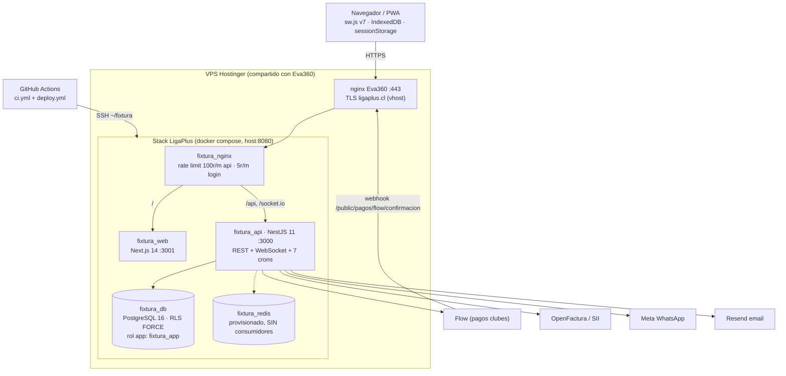
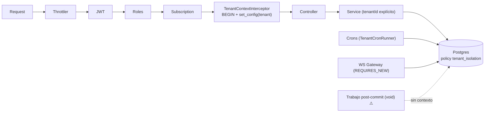

# Auditoría de arquitectura — LigaPlus

**Fecha:** 2026-10-05 · **Commit auditado:** `69fa34a` (main) · **Alcance:** monorepo completo (apps/api, apps/web, packages, infra, CI/CD, docs)

**Método:** 8 revisiones especializadas independientes (arquitectura, mapa del sistema, seguridad OWASP, base de datos, TypeScript, React, fallas silenciosas, testing) ejecutadas en paralelo sobre el código fuente, con **verificación adversarial posterior de cada hallazgo CRÍTICO/ALTO contra el código** (33 hallazgos verificados línea por línea, 0 falsos positivos). Varios hallazgos fueron además **reproducidos empíricamente** ejecutando el código real contra Postgres (WASM) — se marcan [E]. Los verificados manualmente se marcan [V]; el resto proviene de lectura directa del código con cita archivo:línea, sin contradicciones entre revisores.

---

## 1. Resumen ejecutivo

LigaPlus tiene **fundamentos correctos y poco comunes en un SaaS de esta etapa**: aislamiento multi-tenant con RLS FORCE verificado al arranque, un paquete de dominio puro y testeable, cifrado bien hecho para credenciales por liga, cero inyección SQL y cero XSS en todo el repo, locks pesimistas e idempotencia en los flujos que ya dolieron. El monolito modular en un VPS es la topología correcta para la escala objetivo (decenas de ligas) y **no hay que cambiarla**.

El problema no es el diseño: es que **tres sistemas transversales fallan en silencio** y hoy no se nota porque hay una sola liga y los pagos corren en mock:

1. **El aislamiento RLS es fail-open.** El marcador de bypass (`''`) es el valor que Postgres deja residualmente en cualquier conexión reusada del pool. Todo lo que corre fuera de la transacción del request —crons de facturación, boletas emitidas "en segundo plano", auditoría— funciona hoy por casualidad, y con una segunda liga leería o escribiría datos cruzados de forma no determinista.
2. **La semántica transaccional convierte errores en éxitos.** Cada request vive en una transacción; los ~20 bloques `try/catch` "best-effort" que tragan errores de Postgres dejan la transacción abortada y el COMMIT final se convierte en ROLLBACK **sin excepción**: el usuario recibe 200 y nada se guardó. Afecta facturación mensual, importación de planteles, cierre de actas, encuestas.
3. **Las rutas de dinero tienen huecos verificados.** Un delegado puede "pagar" cobros reales a través de la pasarela mock (y emitir boleta SII real); un pago tardío de Flow jamás se acredita; la cobranza automática nunca envió un email pero la UI muestra "N avisos enviados"; y existe una **toma de cuenta cross-tenant** (hasta super admin) explotable en 3 requests por cualquier coordinador de liga.

A esto se suma una capa de operación frágil: backups que solo viven dentro del VPS (y cuyo script apunta a un contenedor que no existe), dos pipelines de deploy contradictorios con una migración `DROP TABLE CASCADE` en la ruta automática, un CI rojo permanente que nunca ejecutó ni los 9 tests que existen, y chequeos de arranque que debían tumbar el contenedor pero dejan un proceso zombi.

**Veredicto: apta para operar la liga actual con supervisión manual; NO apta para incorporar una segunda liga ni para activar pagos reales sin ejecutar antes la Fase 0 del roadmap (§9).** La buena noticia: casi todo lo crítico es esfuerzo S/M, concentrado, y el diseño de fondo no necesita reescritura.

### Puntajes por área (1-10)

| Área | Nota | Justificación en una línea |
|---|---|---|
| 1. Arquitectura general | **6** | Monolito modular correcto, dominio puro, ADRs reales; pero AdminModule es una bolsa de 47 controllers y los contratos se declaran 3 veces |
| 2. Backend (NestJS) | **5** | Guards/RBAC densos y bien usados; la semántica transaccional (catch envenenado, `void` post-commit) invalida garantías en flujos críticos |
| 3. Datos (modelo, RLS, migraciones) | **5** | Cobertura RLS completa tabla por tabla; pero policy fail-open, schema viviendo en un script de arranque de 2.780 líneas y cascadas destructivas |
| 4. Seguridad | **4** | Sin SQLi/XSS, cifrado y firma correctos, RBAC casi total; pero 1 toma de cuenta CRÍTICA explotable, pagos mock alcanzables y DoS trivial vía nginx |
| 5. Frontend (Next.js) | **6** | Patrones sólidos (TanStack, forms, PWA pensada, logout higiénico); pero doble-submit en dinero, offline roto de raíz y a11y deficiente |
| 6. Operación | **3** | Contenedores bien configurados; pero backups solo locales y mal apuntados, deploy dual peligroso, observabilidad no cableada, bootstrap zombi |
| 7. Calidad / Testing | **2** | 9 tests en todo el repo (0 en el API), CI rojo permanente por dos causas apiladas, sin forma de levantar el schema desde cero |

---

## 2. Arquitectura actual

### Topología de despliegue



### Ciclo request → RLS



El punto estructural: **todo lo que entra por la flecha de arriba está protegido; todo lo que entra por las tres de abajo depende de disciplina manual**, y dos de esas tres vías tienen hoy errores verificados (§3 C-2).

---

## 3. Hallazgos CRÍTICOS

### C-1 · Toma de cuenta cross-tenant vía onboarding de personal (hasta SUPER_ADMIN) [V]

**Qué pasa.** La activación pública de personal usa el email **actual** de la ficha, no el email firmado en el magic link, y al activar **pisa la contraseña de cualquier cuenta existente** con ese email. Cadena verificada eslabón por eslabón:
1. El link de invitación guarda `personalId` + email del momento — `personal-admin.service.ts:92-96`.
2. `resolverPersonalDeToken` solo valida el tenant, nunca compara emails — `:208-213`.
3. `PATCH /admin/personal/:id` permite cambiar el email libremente (unicidad solo intra-tenant) — `:396-398`.
4. La activación hace `crearOObtenerPorEmail(personal.email)` → devuelve la cuenta global existente → `setPasswordHash` la sobreescribe — `personal-admin.service.ts:259-265`, `users.service.ts:62-63,120-122`.

**Explotación.** Un LIGA_ADMIN o LIGA_COORDINADOR de cualquier liga: crea un personal con su propio email → se invita (el token le llega a él) → cambia el email de la ficha al de la víctima → activa con el token fijando la contraseña que quiera. Entra con **todos los roles de la víctima en todos los tenants**; si apunta al super admin, controla la plataforma. Sin `@Audited` en esos pasos y sin revocación de sesiones.

**Impacto de negocio.** Compromiso total de la plataforma por un insider de cualquier liga cliente. Hoy el círculo es pequeño (1 liga); con la segunda, cualquier admin ajeno puede hacerlo.

**Recomendación (S).** (1) Exigir `link.email === personal.email` (o usar solo `link.email`); (2) consumir el link atómicamente (`UPDATE … WHERE used_at IS NULL` + chequear `affected`) **antes** de tocar credenciales; (3) si la cuenta ya tiene contraseña, NO sobreescribir — solo asignar rol; (4) revocar refresh tokens al fijar contraseña + auditar. Misma raíz (pisar contraseña) existe en los flujos de delegado y jugador — ahí mitigada porque atan el email al link, pero corregir el patrón en los tres.

### C-2 · RLS fail-open: el bypass `''` es el estado residual de toda conexión usada [V][E]

**Qué pasa.** La policy (`cleanup-orphans.ts:2749-2759`) trata `''` como bypass de sistema. Pero tras cualquier transacción que hizo `set_config(..., true)`, `current_setting(..., true)` devuelve `''` —no NULL— en esa conexión. **Reproducido empíricamente**: una query fuera de transacción sobre una conexión reciclada del pool ve TODOS los tenants y puede insertar cross-tenant; sobre una conexión nueva ve 0 filas.

**Caminos afectados verificados:**
- `facturacion-plataforma.cron.ts:98,200,243` hace `set_config` **fuera de transacción** → sin efecto. Recordatorios de mora y suspensión de morosos funcionan solo mientras la conexión venga "tibia" [V].
- Todo el trabajo lanzado con `void` que sigue vivo tras el COMMIT (emisión SII, push, auditoría del interceptor `audited.interceptor.ts:68,87`) corre sin transacción ni contexto: en bypass o contra la pared del WITH CHECK, según la suerte del pool [V].
- La policy castea `tenant_id::text`, lo que además produce **planes 40-100× peores** (medido: 21,8ms→0,56ms en el caso con índice) [E].
- Agravante: un usuario autenticado con roles en 2+ ligas recibe `tenantId=null` → el interceptor setea `''` → corre en bypass.

**Impacto de negocio.** Con 2+ ligas: fuga y escritura cruzada de datos no determinista, boletas que no se crean o se crean sin dueño, imposible reconstruir qué se filtró.

**Recomendación (M).** Policy fail-closed con bypass explícito y casteo correcto:
```sql
USING (tenant_id = NULLIF(current_setting('app.current_tenant_id', true), '')::uuid
       OR current_setting('app.rls_bypass', true) = 'on')
```
(mismo `WITH CHECK`; una migración `ALTER POLICY` para todas las tablas — `ensureRls` hoy solo crea IF NOT EXISTS y no puede corregirlas). + Un único helper `withTenantContext()/runAsSystem()` en `common/rls` para crons, gateway y efectos post-commit, con un grep en CI que prohíba `set_config` fuera de esa carpeta (hoy ~10 archivos lo llaman a mano). + Test de conexión tibia (ya prototipado por la auditoría). **Ojo:** al corregir la policy, todo lo que hoy funciona por casualidad va a fallar — corregir C-2 y los crons en el mismo cambio.

### C-3 · La pasarela MOCK es alcanzable en producción: cobros "pagados" sin dinero [V]

**Qué pasa.** `resolverPasarela` devuelve `{tipo:'MOCK'}` para toda liga sin Flow habilitado (`pagos.service.ts:447`), el mock aprueba cualquier token `MOCK-*`, y el endpoint de confirmación es público. Además el `docker-compose.yml` **no reenvía** `WEBPAY_MODE`, `SII_MODE`, `WHATSAPP_PROVIDER`, `PUSH_MODE` ni `VAPID_*` al contenedor [V]: aunque estén en el `.env` del VPS, los providers de plataforma quedan clavados en mock — y no existe ningún guard de arranque que lo impida.

**Explotación.** Un DELEGADO_EQUIPO de una liga sin Flow: `POST /delegado/cobros/:id/pagar` → `POST /public/pagos/:txId/confirmar` → el cobro queda `pagadoAt` con método `OTRO`. Si la liga tiene SII BYO activo, **se emite una boleta real por dinero que nunca existió**. La misma mecánica deja pagar facturas de suscripción de la plataforma y reactivar una liga suspendida por mora.

**Impacto de negocio.** Evasión de pagos indetectable (el estado es idéntico a un pago real) + documentos tributarios reales sin respaldo de dinero.

**Recomendación (S).** En `NODE_ENV=production`: `resolverPasarela` lanza 400 si no hay pasarela configurada, y el bootstrap aborta si algún provider quedó en mock salvo `ALLOW_MOCK_PROVIDERS=true` explícito. Ocultar "Pagar" en la UI si la liga no tiene pasarela. Propagar las variables de modo en el compose (o pasar a `env_file`).

---

## 4. Hallazgos ALTOS

### A-1 · Flow: dinero capturado que nunca se acredita [V parcial]
- `confirmarTx` marca **EXPIRADO (estado final) por reloj local antes de consultar a Flow** (`pagos.service.ts:288-293`) [V] y `crearPago` no envía `timeout` a Flow: una transferencia que entra a los 35 minutos queda capturada en Flow y jamás acreditada; la UI pide "iniciar un nuevo pago" → doble cobro.
- El webhook **siempre responde `{ok:true}`**, incluso ante error de Postgres o de credenciales (`pagos.controller.ts:112-119`) → Flow deja de reintentar y la tx queda `PAGO_EN_TRANSITO` para siempre. **No existe cron de reconciliación** (el índice `idx_transacciones_estado` quedó sin consumidor).
- `iniciarPago` sin lock ni unique → doble clic = 2 órdenes Flow; y si el cobro ya estaba pagado por la otra vía, el flujo igual dispara una **segunda boleta** (el unique de documentos es por transacción, no por cobro).
- El "registro de auditoría" del intento fallido se guarda y luego se lanza la excepción → el rollback lo borra (`:210-219`).

**Recomendación (M):** consultar a Flow antes de expirar + enviar `timeout`; webhook responde 5xx ante error transitorio; cron reconciliador de `PAGO_EN_TRANSITO`; lock/unique en iniciar; registrar fallos en transacción propia (REQUIRES_NEW).

### A-2 · SII: emisor equivocado, duplicados posibles y fail-open [V parcial]
- Las boletas de **suscripción de la plataforma** se guardan con `tenantId` = la liga; el cron SII de la liga las reintenta con `byoDe(tenantId)` → **la boleta de LigaPlus puede emitirse con el RUT y la cuenta OpenFactura de la liga** [V: cron sin filtro de emisor + byoDe por tenant]. La entidad no distingue origen.
- Si la clave BYO no se puede descifrar (PAGOS_ENC_KEY rotada/ausente), `byoDe` devuelve null **en silencio** y cae al provider global — en prod, el mock, que marca `EMITIDO` con folio ficticio [V].
- `emitir` no tiene claim/lock y el payload a OpenFactura **no lleva clave de idempotencia** (el comentario que la promete es falso): botón reintentar + cron + emisión inicial pueden solaparse → folios duplicados.
- El cron emite hasta 20 documentos HTTP (30s c/u) **dentro de una sola transacción por tenant**: un error al final revierte los `EMITIDO` de documentos ya emitidos ante el SII → re-emisión en el próximo ciclo.
- `crearYEmitirAsync` corre con `void` tras el commit (§C-2): el documento `PENDIENTE_EMISION` puede **no crearse nunca**, y el cron solo reintenta filas existentes → pago sin boleta ni rastro.

**Recomendación (M):** columna `emisor` (`PLATAFORMA`/`LIGA`) + filtros; BYO falla cerrado; crear el documento DENTRO de la tx del pago y emitir post-commit con contexto propio (`runOnTransactionCommit` + `withTenantContext`); claim `FOR UPDATE SKIP LOCKED` + estado `EMITIENDO`; una tx por documento en el cron; enviar `externalReference` idempotente.

### A-3 · Catch que tragan errores dentro de la transacción: COMMIT=ROLLBACK silencioso [V][E]
Mecanismo verificado (3 revisores + ejecución): un error de Postgres tragado deja la tx abortada (25P02) y TypeORM ejecuta el COMMIT final que Postgres convierte en ROLLBACK **sin error** → respuesta 200, nada persistido. Sitios de mayor daño:
- `generarFacturasMes` (facturación mensual de la plataforma): loop con try/catch por tenant en UNA tx → un error revierte TODAS las facturas del mes y loggea "N creadas".
- Cron de cuotas: un duplicate-key envenena la tx del tenant → ese tenant no recibe cuotas nunca más (determinista).
- Importación de planteles: una fila mala → 200 con "creados k-1" y CERO filas guardadas.
- Cierre de acta / walkover: los best-effort de multas y designaciones (`partidos-admin.service.ts:700-752,1406-1420`) convierten errores DB en 500 crípticos o pérdidas parciales [V].
- Tribunal `sancionarEquipo`: `catch {}` vacío → "suspendido y vetado" informado y no persistido.
- **`Propagation.NESTED` de typeorm-transactional 0.5.0 NO es savepoint** (abre otra conexión sin contexto RLS) [V en fuentes de la lib]: el fix correcto es SAVEPOINT manual vía `dataSource.query`.

**Recomendación (S-M):** helper `bestEffort()` con SAVEPOINT/ROLLBACK TO; `INSERT … ON CONFLICT DO NOTHING` para unicidad; red de seguridad transversal: `SELECT 1` antes del COMMIT en interceptor y cron runner (convierte todo rollback silencioso en error visible).

### A-4 · Disciplina deportiva: contadores sin dueño con defectos verificados [V][E]
- Una fecha con un partido `NO_JUGADO`/`SUSPENDIDO`/`REPROGRAMADO` **nunca se finaliza** (solo `cerrarActa` y `declararWalkover` evalúan, y exigen `FINALIZADO|WALKOVER`) [V] → las suspensiones no se descuentan; el flyer sigue anunciando esa fecha como próxima.
- **Reabrir un acta resucita sanciones**: `revertirDecrementoSanciones` suma +1 a TODAS las sanciones del torneo con `desde <= N`, sin registro de cuáles se descontaron — revive cumplidas y hasta revocadas por el tribunal [V][E con el SQL real].
- El `ajustar` del tribunal sube `fechasPendientes` sin tocar `fechasTotales` → al reabrir cualquier acta, el `LEAST(fechas_totales,…)` **recorta una sanción de 4 fechas a 1** [V].
- **Write skew**: dos planilleros cerrando las 2 últimas actas en paralelo → ninguno ve la fecha completa → la fecha no se finaliza ni descuentan sanciones (lock por partido, lectura de hermanos sin lock) [V].
- El criterio "sanción vigente" está copiado en 7 servicios con variantes: el carnet QR ignora `desde_fecha_numero` → el semáforo bloquea a un jugador cuya sanción empieza en una fecha futura.

**Recomendación:** parches S inmediatos (incluir NO_JUGADO como resuelto; lock `FOR UPDATE` sobre `fechas`; `ajustar` actualiza totales; carnet filtra por `desde`); M después: máquina de estados + `sancionVigente()` en `packages/domain`, y cumplimiento como libro mayor `sancion_cumplimientos(sancion_id, fecha_id)` — sin eso el historial no se puede reconstruir.

### A-5 · Dunning: cobranza fantasma total [V]
- El cron revienta **todos los días**: `leftJoinAndSelect('c.equipo')` referencia una relación que `Cobro` ya no tiene (verificado: cero matches en la entity) → lanza al construir la query, y de paso revierte el recálculo de estados de esa corrida.
- El camino manual sí corre… hasta `resolverEmailDestino`, que **retorna `null` incondicional** (TODO v2), y `enviarEmail` hace `return true; // simulamos éxito` [V textual] → incrementa `dunningAvisosEnviados` y `dunningUltimoAvisoAt`.
- Resultado: **ningún aviso de cobranza se ha enviado jamás por ninguna vía**, pero Finanzas muestra "N avisos enviados · último el …" y el botón manual responde `{enviado:true}`.

**Recomendación (S):** quitar el join muerto; resolver el destinatario real (delegados del club vía user_roles); si no hay destinatario, `return false` y NO tocar contadores.

### A-6 · Cuotas recurrentes: cron inerte y camino vivo que factura mal [V]
- **El cron nocturno es código muerto**: la validación de tarifas exige `cantidadCuotas` en toda cuota recurrente (`tarifas-admin.service.ts:194-199`) y el generador salta exactamente las que la tienen (`tarifa-aplicador.service.ts:148`) → no existe tarifa sobre la que pueda actuar [V ambos lados].
- El camino vivo (`generarCobrosInicioTorneo`) **ignora la frecuencia**: una cuota SEMANAL o ANUAL con N cuotas se factura como N mensuales; y `diaDeMesProximo` corre vencimientos (31-ene→31-mar; "hoy 15, día 15"→mes siguiente) [E].
- Latente en el camino muerto: tope `MAX_PERIODOS=24` que corta los períodos **nuevos** en vez de los viejos [V] — si se revive el cron sin arreglarlo, las cuotas dejan de generarse a los ~6 meses.

**Recomendación (S-M):** decidir el modelo (todo por adelantado vs. cron) y borrar el camino muerto; corregir frecuencia y vencimientos con tests de dominio (TZ America/Santiago — los bugs de DST ya están reproducidos).

### A-7 · Backups: solo dentro del VPS y con defaults rotos [V]
Dumps sin cifrar en el mismo host; runbook placeholder; y los defaults del script apuntan a `fixtura-db-1` y `/opt/fixtura` cuando la realidad es `fixtura_db` y `~/fixtura` [V] — si el crontab usa defaults, el fallback por nombre de contenedor falla. Perder el VPS (compartido con otro producto) es pérdida total e irreversible de cobros, pagos y documentos tributarios.
**Recomendación (S):** dump cifrado a B2/S3 con credencial write-only + alerta si falla + restore de prueba mensual. Corregir defaults.

### A-8 · Deploy y CI: dos pipelines contradictorios con una migración destructiva en la ruta automática [V]
- `deploy.yml` corre **en cada push a main**, sin `needs` del CI (el comentario "después de que pase CI" es falso) [V], sin backup, y ejecuta `pnpm migration:run` — con `1748430000000-DropModeloViejo.ts` (`DROP TABLE … CASCADE`) todavía en la carpeta [V].
- Su smoke test apunta a `/api/health/live`, ruta que **no existe** (health está excluido del prefijo: la real es `/health/live`) [V] → el workflow nunca pudo terminar verde; los deploys reales son manuales con `deploy.sh` (que sí hace backup y no migra).
- El CI está **rojo permanente por dos causas apiladas** [V]: ESLint 9 instalado sin `eslint.config.*` (exit 2 en el paso lint) y `"test": "jest"` sin specs (exit 1). Nunca ejecutó ni los 9 tests de domain. El peligro concreto: quien "arregle" el workflow ejecuta el DROP sin backup.

**Recomendación (S):** un solo camino (workflow → invoca `deploy.sh`, `needs: ci`, aprobación manual); sacar `DropModeloViejo` de la carpeta hasta ejecutarlo a mano con backup; arreglar ESLint (flat config) y el smoke test.

### A-9 · Bootstrap zombi: los chequeos "loud failure" no tumban el contenedor [V]
`void bootstrap()` + el handler de `unhandledRejection` solo loggea y **no hace exit** (`main.ts:300-306,317`) [V]. Un fallo en los chequeos de arranque (secretos débiles, FRONTEND_URL, rol superuser) deja un proceso vivo sin `listen` — y compose no reinicia contenedores unhealthy. La regla 9 de CLAUDE.md está rota en la práctica.
**Recomendación (S):** `bootstrap().catch(e => { logger.error(e); process.exit(1) })`.

### A-10 · Superficie de DoS: nginx, dependencias y WebSocket [V parcial]
- El rate limit de nginx indexa por `$binary_remote_addr` sin `set_real_ip_from`, y todo el tráfico llega desde el proxy de Eva360 → **un solo bucket global**: ~8 POST/min a login tiran 503 a todos los usuarios; ~17 hinchas mirando "En vivo" (poll 10s) saturan el límite de API [V conf].
- Dependencias con DoS anónimo alcanzable: Next 14.2.35 (parches solo en 15.5.x), `socket.io-parser` y `engine.io` vulnerables con `/socket.io/` expuesto sin auth.
- El gateway WS acepta cualquier string en `subscribe` sin validar y abre 2 transacciones por segundo por id del set → un socket anónimo con miles de ids basura degrada el pool de toda la API. CORS del WS es reflect-all.

**Recomendación (S/M):** `real_ip_header` + recalibrar; validar UUID + existencia + límite de rooms; upgrade de socket.io ya, Next 15 con ADR; `pnpm audit --audit-level=high` en CI.

### A-11 · Frontend: cinco fallas de alto impacto [V parcial]
- **Doble submit en flujos de dinero**: `Button` usa `disabled={disabled ?? loading}` — si llega `disabled={false}`, el `loading` nunca deshabilita [V]; 14 sitios afectados (registrar pago, emitir nómina, cerrar acta…) sin guarda `isPending`. Combinado con `iniciarPago` sin lock = doble orden real.
- **`Permissions-Policy: camera=()` global bloquea el escáner QR del carnet** (`next.config.mjs:18`) [V] — la feature `69fa34a` fallaría en su primer deploy con un error engañoso.
- **La cola offline no se activa cuando más se necesita**: TanStack con `networkMode` default no invoca `mutationFn` estando offline → el encolado a IndexedDB (que vive dentro de `mutationFn`) nunca corre; las incidencias quedan pausadas en memoria y se pierden al cerrar la PWA [E contra query-core]. Con señal débil (online=true, fetch falla) tampoco encola.
- **El SW sirve datos de un paso atrás como frescos**: stale-while-revalidate sobre `/api/v1/public/*` → cada poll de "En vivo" recibe la respuesta del poll anterior (marcador 10-20s atrás; tras una ausencia, horas). Mismo bug ya corregido para el acta.
- **El muro de pago rebota**: `/suscripcion` no espera la hidratación del store → una liga suspendida (402) aterriza en el home público en bucle [mecanismo V contra zustand 5].

**Recomendación (S cada uno):** `disabled={disabled || loading}` + guarda isPending; `camera=(self)` para `/personal/verificar`; `networkMode:'offlineFirst'` + encolar ante TypeError + consumir `isQueuedResponse`; público a network-first con timeout (en-vivo/match-center a network-only) + `CACHE_VERSION` derivada de `GIT_SHA`; gate `hydrated` (extraer `useAuthHydrated()`).

### A-12 · Testing: 9 tests en todo el repo y un CI que no los ejecuta [V]
0 specs en apps/api (28.305 líneas de services) y apps/web; 315 endpoints sin un solo test de integración; el Postgres del CI no lo usa nadie (y conecta como superuser: cualquier test de RLS sería vacuo); no existe comando para levantar el schema desde cero (migración `magic_links` duplicada; cleanup-orphans asume tablas que no crea). La auditoría dejó **prototipos ejecutables** de los 5 tests más valiosos (RLS conexión tibia, reabrir acta, períodos de cuotas, Flow concurrente, gate de schema).
**Recomendación (M):** no perseguir cobertura: 12-15 tests de comportamiento priorizados, harness con rol `fixtura_app` real, factories mínimas, y el gate de schema por catálogo (`pg_class`/`pg_policies`) en CI.

### A-13 · Sesiones: refresh frágil y sin offboarding
Rotación no atómica (`findOne`+`update`: dos pestañas → dos cadenas válidas, sin detección de reuso), no chequea `isActive`, lookup por `token_hash` sin índice utilizable (seq scan cada 15 min por sesión) y sin purga (la tabla solo crece). Desactivar un personal no revoca roles ni tokens; no hay revocación para delegados/jugadores: un planillero dado de baja con designación vigente sigue operando actas.
**Recomendación (S-M):** `UPDATE … WHERE revoked_at IS NULL` + `affected`; índice parcial por hash; chequear `isActive`; revocar cadena ante reuso; cron de purga; endpoints de baja que revoquen roles+tokens.

### A-14 · Cascadas que destruyen historial [V en FKs]
Borrar un club (botón de admin, sin guardas) cascadea inscripciones y jugadores y deja partidos "? vs ?" — tabla y rankings rotos. Borrar un jugador deja goles sin autor. Se puede borrar un cobro **pagado** (transacción y boleta quedan huérfanas). `facturas_plataforma.tenant_id` es CASCADE: borrar una liga borra los ingresos de LigaPlus.
**Recomendación (S-M):** FKs a RESTRICT vía migración formal + guardas de servicio (usar INACTIVO; prohibir borrar cobros pagados).

---

## 5. Hallazgos MEDIOS (consolidados)

| # | Hallazgo | Esf. |
|---|---|---|
| M-1 | **Límites de módulo**: AdminModule = 47 controllers/44 providers; CompetitionModule exporta 32 entities a cualquiera; `PartidosAdminService` 1.804 líneas con 12 repos; `CategoriasAdminModule` huérfano (partición a medias). El monolito está bien; las fronteras no | L (incremental) |
| M-2 | **Contratos triplicados**: 271 schemas Zod + 73 DTOs class-validator + CHECKs, sin `implements` → divergencias reales que pierden datos: `UpdatePartidoDto` sin `canchaId` (la UI lo envía y el whitelist lo descarta → 200 sin guardar), cobros sin `torneoId/inscripcionId`, tribunal sin el `.refine` (200 que no hace nada). Y `Schema.parse` directo en 11 controllers → entrada inválida = 500 | S + M |
| M-3 | **Esquema en script de arranque**: 2.780 líneas, 36 CREATE TABLE, DELETE de datos en cada boot (viola su propia regla), backfills que repueblan planillas vaciadas a propósito, sin `lock_timeout` (~40 ALTER con ACCESS EXCLUSIVE por arranque), credenciales superuser en el env del API [V] | M |
| M-4 | **Auditoría no garantizada**: `void record()` compite con el COMMIT; logins fallidos con rollback pierden su `.failed`; 28 rutas mutantes sin `@Audited` (tribunal, cobros, match-center, personal…); `fixtura_app` tiene UPDATE/DELETE sobre `audit_logs` | S-M |
| M-5 | **Transacción = request entero**: HTTP externo con locks tomados (Flow 12s con FOR UPDATE), emails dentro de la tx, pool de 20 sin `connectionTimeoutMillis`/`statement_timeout`/`idle_in_transaction_session_timeout`, `/health/live` pasa por el pool | S |
| M-6 | **Tick del match center**: 2 transacciones REQUIRES_NEW por segundo por partido, sin guard de reentrada; 30 partidos ≈ 240 statements/s contra pool de 20; partido PAUSADO abandonado hace tick para siempre | S-M |
| M-7 | **BYO repartido**: cada service descifra por su cuenta con semánticas distintas (Flow falla cerrado, SII falla abierto); `FLOW_MODE` global impide sandbox por liga; `secret-box` sin versión de clave (rotar PAGOS_ENC_KEY = recifrar todo a mano) | M |
| M-8 | **`customDomain` sin validación ni prueba de propiedad**: un admin puede reservar el dominio de otra liga o `ligaplus.cl`, y cada dominio entra a la whitelist CORS con credentials al reinicio | S |
| M-9 | **`invitarMiembro` asigna roles a cuentas existentes sin consentimiento** + filtra nombre/último login cross-tenant + puede dejar a la víctima sin acceso (tenantId=null con roles en 2+ ligas → 403 en todo) | M |
| M-10 | **HTML injection en emails** desde dominio de confianza (nombres interpolados sin escapar en 4 plantillas; invitación masiva = phishing a escala), sin cuota por tenant | S |
| M-11 | **Tokens en query string** (activaciones, NPS, encuestas, designaciones) → logs de pino y Sentry sin scrubbing; vigencias de 7-30 días | S |
| M-12 | **Emails "enviados" que no se enviaron**: `EmailService.send` nunca lanza y devuelve `false` que 6 flujos ignoran (personal responde `enviado:true` incondicional; encuestas marcan la fila enviada para siempre) | S |
| M-13 | **Observabilidad**: Sentry del web nunca inicializado (los `captureException` son no-op), API sin `SentryModule`/filtro (los 500 no se reportan), `/metrics` prometido sin `prom-client` cableado, 15 `console.*` fuera de pino, TZ de la DB posiblemente UTC (vencimientos corridos 21:00-24:00) | S-M |
| M-14 | **Índices**: colisión de nombres → `idx_incidencias_jugador` NO existe en prod (lo usan los rankings); FKs calientes sin índice (`partido_jugadores.jugador_id` ~700k filas/año); 15 redundantes | S |
| M-15 | **Frontend TanStack/forms/a11y**: 5 invalidaciones con claves muertas (suspender/reprogramar/no-jugado no refrescan el fixture), doble/triple toast por error, mensajes Zod en inglés (~60 campos), 5 descargas con `fetch` crudo sin refresh de 401, 14 modales sin semántica de diálogo, 124 labels sin asociar, contraste del naranja de marca 2.66:1 | S-M |
| M-16 | **Onboarding de liga = infraestructura manual** (custom_domain + cert + editar el nginx de otro producto). `{slug}.ligaplus.cl` con certificado wildcard resolvería | S-M |

## 6. Hallazgos BAJOS (selección)

Redis provisionado (512MB reservados) sin un solo consumidor; `bullmq`/`ioredis`/`cache-manager`/`i18next`/`@sentry/nextjs`/`passport` instalados sin uso; stubs muertos (MercadoPago registrado sin consumidores, FCM, Twilio, Khipu, `WebpayPlusProvider` que siempre lanza); `packages/ui` documentado e inexistente; `--frozen-lockfile=false` en CI y Dockerfiles; magic links de designación con GET público que muta estado (escáneres de email pueden confirmar/rechazar); `xlsx` con CVEs (parseo solo client-side); AES-GCM sin AAD ni keyring; export ARCO busca por `users.rut` que nada puebla; docs divergentes (`/opt/fixtura` vs `~/fixtura`, OPS_RUNBOOK desactualizado); voseo residual en 5 archivos de UI; bundle: `@fixtura/types` en CommonJS duplica zod (~85KB gz en 21 rutas), `LoginModal` estático en rutas públicas (~35-40KB gz).

---

## 7. Fortalezas (preservar explícitamente)

1. **RLS con FORCE en las 42 tablas tenant, sin omisiones** (verificado tabla por tabla) + rol no-superuser validado al boot con aborto. La decisión más valiosa del sistema — los hallazgos son sobre la *policy*, no sobre la cobertura.
2. **`packages/domain` puro**: fixture Berger con tests, tabla de posiciones compartida por 6 services, acumulación de tarjetas. Extenderlo (sanciones, estados de partido), no reemplazarlo.
3. **Cero inyección SQL y cero XSS** en todo el repo (dos revisores independientes); ningún DTO acepta `tenantId` del cliente; IDOR intra-tenant bien resuelto (scopes PERSONAL desde el JWT, `assertActorPuedeOperar`).
4. **Los flujos que ya dolieron quedaron bien**: lock pesimista + validación de monto/orden en `confirmarTx`, idempotencia offline por `clientKey` con unique parcial, rethrow correcto en `equipos.suspender`, logout que limpia SW+IndexedDB+cache.
5. **Cifrado y tokens correctos**: AES-256-GCM bien usado, secretos BYO write-only jamás devueltos, refresh opaco con sha256 en reposo, magic links hasheados con TTL, carnet QR con HMAC de propósito dedicado y `timingSafeEqual`.
6. **Infra base sana**: contenedores no-root con tini, límites de memoria/CPU, healthchecks, rotación de logs, Postgres y Redis sin puertos publicados, `deploy.sh` con backup previo.
7. **Frontend con patrones consistentes**: TanStack bien usado (keys con filtros, enabled, polling pausado en background), `FormErrorBanner`+`onInvalid` en todos los submit, PWA con allowlist explícita para el acta y fallback offline, cliente HTTP con refresh single-flight.
8. **El tick del match center es por partido, no por espectador** — la carga no crece con la audiencia (el costo por partido sí es alto: M-6).

---

## 8. Riesgos de escalabilidad y multi-tenant (síntesis)

Al pasar de 1 a N ligas, en orden de aparición:
1. **Fuga cross-tenant no determinista** (C-2) — aparece con la liga 2, intermitente, indetectable después.
2. **Toma de plataforma por insider de cualquier liga** (C-1) — el círculo de atacantes crece con cada liga.
3. **Evasión de pagos** (C-3) — cada liga nueva sin Flow configurado nace con el mock activo.
4. **DoS mutuo entre ligas** (A-10) — el bucket único de nginx hace que el tráfico de una liga tire 503 a todas.
5. **Onboarding manual** (M-16) — cada liga requiere DNS + certificado + editar la infra de Eva360.
6. **Un solo proceso** para HTTP+WS+crons con pool de 20 sin timeouts (M-5/M-6) — el domingo de partidos compite con la facturación; una pasarela lenta cuelga el API completo.
7. **Operación a ciegas** (M-13 + A-7) — sin Sentry efectivo, sin métricas y con backups solo locales, el primer incidente multi-liga se diagnostica sin datos y sin respaldo externo.

---

## 9. Roadmap de remediación

### Quick wins — antes de la próxima liga / pagos reales (1-2 semanas)
1. **C-1**: ligar activación al email del link + consumo atómico + no pisar contraseñas + revocar sesiones *(medio día)*.
2. **C-3**: guard anti-mock en prod + ocultar "Pagar" sin pasarela + propagar env en compose.
3. **A-7**: backup externo cifrado + corregir defaults + alerta + restore de prueba.
4. **A-8**: `DropModeloViejo` fuera de la carpeta; deploy.yml gated por CI o deshabilitado; arreglar ESLint y smoke test.
5. **A-9**: `bootstrap().catch(exit 1)`.
6. **A-10**: `set_real_ip_from` en nginx + upgrade socket.io/engine.io + validar `subscribe`.
7. **A-5**: dunning — quitar join muerto + destinatario real o `false` honesto.
8. **A-11**: Button `||`, `camera=(self)`, gate `/suscripcion`, keys de invalidación muertas *(1 hora en total)*.
9. **A-1 parcial**: consultar a Flow antes de expirar + webhook 5xx ante error transitorio.
10. **M-5**: timeouts de pool/statement + exentar `/health` del interceptor.
11. **A-4 parches**: NO_JUGADO como resuelto + lock de `fechas` + `ajustar` actualiza totales + carnet filtra `desde`.

### 30 días
12. **C-2 completo**: policy fail-closed (`ALTER POLICY` masivo) + `withTenantContext` único + grep de CI + corrección simultánea de crons/post-commit + test de conexión tibia.
13. **A-2**: columna `emisor` + BYO fail-closed + documento dentro de la tx + emisión post-commit con contexto + claim por documento.
14. **A-1 completo**: cron reconciliador de `PAGO_EN_TRANSITO` + lock en iniciar.
15. **A-3**: helper savepoint + `SELECT 1` pre-commit en interceptor/runner + `ON CONFLICT` en idempotencias.
16. **A-12**: harness de test con RLS real + 12-15 tests de comportamiento (empezar por los 5 prototipados).
17. **A-6**: unificar el modelo de cuotas, borrar el camino muerto, corregir frecuencia/vencimientos con tests TZ.
18. **A-13 + M-4**: refresh atómico con índice + offboarding + auditoría garantizada.
19. **A-11 resto**: `networkMode` offline + estrategia SW por tipo de dato + versión por GIT_SHA.
20. **M-3 inicio**: congelar cleanup-orphans + baseline `pg_dump --schema-only` + job `migrator` separado (saca el superuser del env del API).

### 90 días (incremental)
21. **M-1**: extraer contextos Finanzas y Disciplina de AdminModule (regla desde hoy: ningún controller nuevo entra ahí).
22. **M-2**: filtro ZodError global ya; luego Zod como fuente única (`createZodDto`).
23. **M-16**: `{slug}.ligaplus.cl` wildcard; custom_domain validado por DNS TXT y solo super admin.
24. **M-9/M-10/M-11**: aceptación de roles por link, `esc()` en emails + cuota, tokens fuera de la query string.
25. **M-13**: Sentry real en API y web; métricas mínimas o retirar la promesa de CLAUDE.md.
26. **M-6/M-7**: tick por lotes + worker entrypoint para crons pesados; módulo `integraciones` fail-closed + keyring versionado.
27. **M-15 + bundle**: modal `<dialog>` único, contraste, types a ESM, dynamic imports.
28. **A-10**: Next 15 (requiere ADR — CLAUDE.md fija 14).
29. Decisión Redis: usarlo (throttler/cache/locks de cron) o retirarlo.

**Barato hoy, caro en 6 meses:** la policy RLS (después no sabrás qué se filtró), el campo `emisor` (después hay que conciliar con el SII), el libro mayor de sanciones (después el historial no se reconstruye), el baseline del schema (después el drift ya existe), la fábrica de query keys (hoy son 220 hooks).

**Aceptar conscientemente (no tocar):** monolito en VPS único (sin microservicios/colas/K8s), app autenticada en `'use client'`, TypeORM y PWA (ADR-0001/0002), instancia única (documentarla como ADR), no partir AdminModule de una vez.

---

## 10. Arquitectura objetivo y ADRs sugeridos

La arquitectura objetivo **es la actual con cuatro correcciones estructurales**, no un rediseño:

1. **Contexto RLS como única puerta**: policy fail-closed + `withTenantContext()/runAsSystem()` como único punto de entrada al contexto (request, cron, WS, post-commit), con lint/CI que lo fuerce.
2. **Efectos fuera de la transacción**: patrón outbox liviano (tabla + `runOnTransactionCommit` + worker in-process) para email, WhatsApp, push, emisión SII y auditoría. La tx del request solo toca Postgres.
3. **Schema con una sola fuente de verdad**: baseline + migraciones formales ejecutadas por un job `migrator` con credenciales de owner; `cleanup-orphans` congelado y el API corriendo solo con `fixtura_app`.
4. **Módulos por contexto de dominio** (incremental): Competición, Disciplina, Finanzas, Portales, Comunicaciones, Plataforma — cada uno con sus entities y fachada; `CompetitionModule` deja de ser un repositorio universal.

**ADRs a escribir** (en `docs/decisions/`):
- ADR-0012: Política RLS v2 — bypass explícito, centinela de sistema, plan de migración de policies.
- ADR-0013: Efectos post-commit y outbox — qué sale de la transacción del request y cómo.
- ADR-0014: Gestión de schema — baseline, migrator job, retiro de cleanup-orphans como DDL.
- ADR-0015: Modelo de cumplimiento de sanciones — ledger `sancion_cumplimientos` en vez de contadores.
- ADR-0016: Contratos FE↔BE — Zod como fuente única (createZodDto), política de validación.
- ADR-0017: Multi-liga por subdominio wildcard — onboarding sin tocar infra.
- ADR-0018: Upgrade Next 14→15 y política de parches de seguridad de dependencias.
- ADR-0019: Instancia única asumida — qué cambiaría para una segunda réplica (throttler, ticks, crons).
- ADR-0020: Redis — adoptar con usos concretos o retirar.

---

## Anexo: inventario de verificación

33 hallazgos CRÍTICO/ALTO verificados manualmente contra el código durante la auditoría: la cadena completa de C-1; policy, crons y `void` post-commit de C-2; `resolverPasarela` y compose de C-3; EXPIRADO/webhook de A-1; `byoDe` y cron de A-2; best-effort del cierre de acta de A-3; NO_JUGADO, `revertirDecrementoSanciones` y `ajustar` de A-4; entity `Cobro` sin `equipo` y `resolverEmailDestino` null de A-5; validación vs. skip de cuotas de A-6; `backup-db.sh` vs compose de A-7; deploy.yml, DropModeloViejo, ESLint y smoke test de A-8; `void bootstrap()` de A-9; nginx de A-10; `disabled ??` y `camera=()` de A-11; specs y scripts de test de A-12; FKs de A-14; superuser en env del API de M-3. Reproducciones empíricas [E]: bypass RLS en conexión reciclada, planes de la policy, SQL de reabrir acta, fechas de cuotas (DST), `networkMode` de TanStack. **Ningún hallazgo verificado resultó falso.**

Informes fuente: 8 revisiones especializadas de la sesión de auditoría del 2026-10-05.
